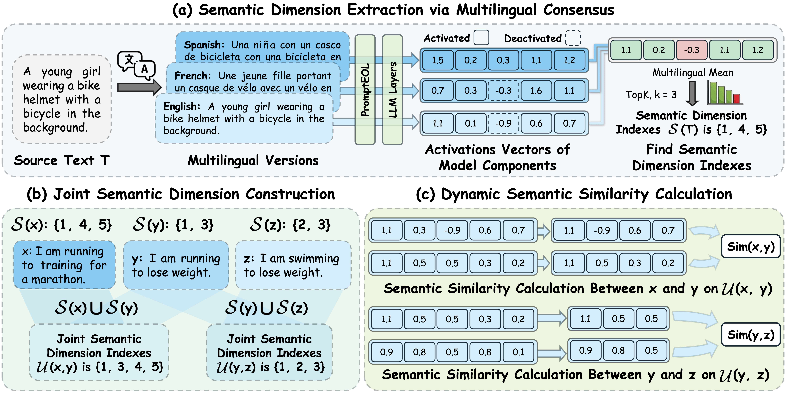
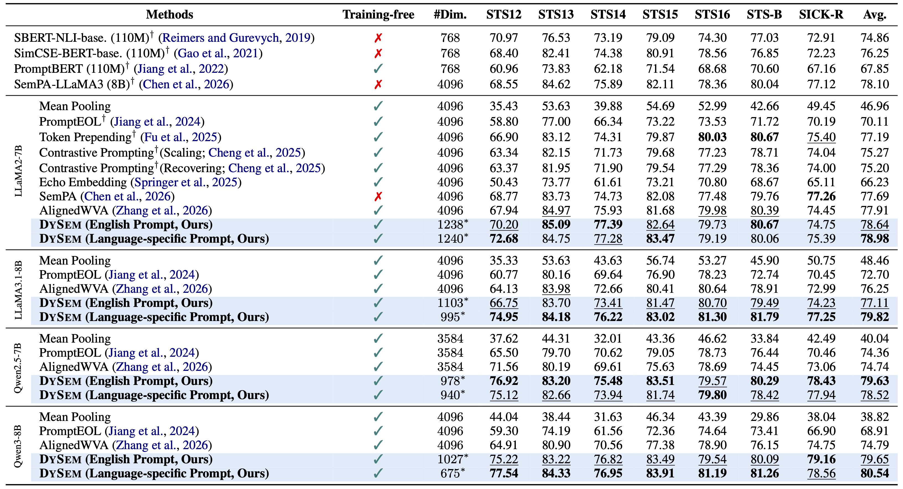

<div align="center">
  
# DySem: Uncovering Dynamic Semantic Components <br>of Large Language Models for Calculating Semantic Textual Similarity

[](https://arxiv.org/abs/2605.29751)
[](https://github.com/szu-tera/DySem)

<div align="center" style="font-family: Arial, sans-serif;">
  <p>
    <a href="#news" style="text-decoration: none; font-weight: bold;">🎉 News</a> •
    <a href="#overview" style="text-decoration: none; font-weight: bold;">📌 Overview</a> •
    <a href="#main-results" style="text-decoration: none; font-weight: bold;">📊 Main Results</a>
  </p>
  <p>
    <a href="#getting-started" style="text-decoration: none; font-weight: bold;">✨ Getting Started</a> •
    <a href="#acknowledgements" style="text-decoration: none; font-weight: bold;">🤝 Acknowledgements</a>
  </p>
  <p>
    <a href="#contact" style="text-decoration: none; font-weight: bold;">📨 Contact</a> •
    <a href="#citation" style="text-decoration: none; font-weight: bold;">🎈 Citation</a>
  </p>
</div>

</div>

## 🎉News

- **[2026/5]** We release both the paper and code for DySem.

---

## 📌Overview

We propose **DySem**, a novel training-free framework that identifies more semantically relevant internal components through *multilingual consensus* and moves beyond static representation spaces by dynamically selecting sample-specific semantic dimensions. Specifically, DySem constructs a text-dependent joint semantic set and computes similarity over this selected dimensional subset. It achieves superior performance across standard STS benchmarks and diverse base and instruction-tuned LLMs, consistently outperforming strong training-free baselines while using substantially fewer dimensions.

<div align="center">
  
</div>

---

## 📊Main Results

**DySem** achieves strong and consistent performance across standard STS benchmarks on both base and instruction-tuned LLMs. Across ten evaluated model settings, its two variants obtain the best and second-best average results. On base models, DySem reaches **78.98** on LLaMA2-7B and **80.54** on Qwen3-8B, outperforming AlignedWVA by up to **5.75** points and PromptEOL by up to **11.63** points. On instruction-tuned models, DySem achieves the best average score in every setting, including **81.20** on LLaMA3.1-8B-it and **80.16** on Qwen3-8B-it. Overall, these results show that dynamic semantic dimension selection effectively filters non-semantic noise and improves STS computation while using substantially fewer dimensions.

- **Base Models.** DySem achieves strong and consistent performance on base LLMs, outperforming strong training-free baselines while using fewer dimensions.

<div align="center">
  
</div>

- **Instruction-tuned Models.** DySem also performs best across instruction-tuned LLMs, showing that dynamic semantic dimension selection effectively filters non-semantic variation introduced by instruction tuning.

<div align="center">
  
</div>

---

## ✨Getting Started

Clone the repository and install DySem:

```shell
# Clone the repository
git clone https://github.com/szu-tera/DySem.git
cd DySem

# Install the package and dependencies
pip install -e .
```

Configure the evaluated causal LLMs in `configs/models.yaml`:

```yaml
models:
  - path: /path/to/local/causal-lm
    tag: organization/model-name
```

You can also evaluate a single model directly with environment variables:

```bash
MODEL_PATH=/path/to/local/causal-lm MODEL_TAG=organization/model-name bash run_dydim_eval.sh
```

Run the default DySem evaluation grid:

```bash
bash run_dydim_eval.sh
```

The default grid evaluates both prompt settings and semantic vector variants:

```bash
PROMPT_SETTINGS="english language-specific"
SEMANTIC_VECTORS="source mean"
LANGUAGE_COUNTS="12"
DIMENSION_SIZES="256 512 768 1024 1280 2048"
```

To reproduce a specific model setting, use the prepared scripts:

```bash
bash scripts/Qwen3-8b/EP.sh
bash scripts/Qwen3-8b/LP.sh
```

Translations are cached locally. We recommend running translation on CPU to avoid competing with the evaluated LLM for GPU memory:

```bash
TRANSLATION_DEVICE=cpu TRANSLATION_BATCH_SIZE=8 bash run_dydim_eval.sh
```

Evaluation artifacts are written to project-local directories:

```text
translation_cache/  # generated translations
rank_cache/         # reusable language-ranking files
results/            # final evaluation CSV files
```

For a quick configuration check without loading a model:

```bash
DYDIM_DRY_RUN=1 bash run_dydim_eval.sh
```

For a minimal STSBenchmark smoke test:

```bash
TASKS="STSBenchmark" LANGUAGE_COUNTS="1" DIMENSION_SIZES="256" PROMPT_SETTINGS="english" SEMANTIC_VECTORS="mean" bash run_dydim_eval.sh
```

---

## 🤝Acknowledgements

This project builds upon the following open-source projects:

- [Hugging Face Transformers](https://github.com/huggingface/transformers)
- [MTEB](https://github.com/embeddings-benchmark/mteb)
- [Hugging Face Datasets](https://github.com/huggingface/datasets)

We sincerely thank the authors and contributors for their valuable work.

---

## 📨Contact

- Kaijie Zheng: liushengle35@gmail.com
- Weiqin Wang: here1swqw@gmail.com 

---

## 🎈Citation

If you find this work useful for your research, please consider citing our paper:

```bibtex
@article{zheng2026dysem,
  title={DySem: Uncovering Dynamic Semantic Components via Multilingual Consensus for Calculating Semantic Textual Similarity},
  author={Kaijie Zheng, Weiqin Wang, Yile Wang, Hui Huang},
  journal={arXiv preprint arXiv:2605.29751},
  year={2026}
}
```
